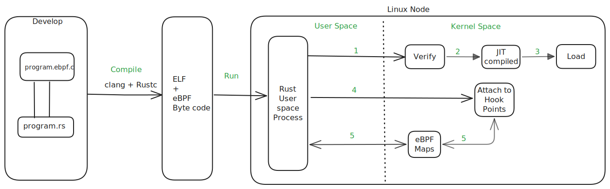
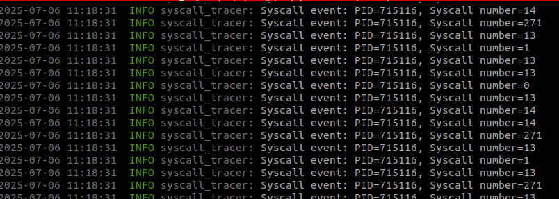

# Intro into eBPF and Rust

In this post, we’ll explore how to build high-performance Linux tracing tools using eBPF and Rust. Whether you're just getting started with eBPF or curious about integrating it with modern Rust tooling, this guide will walk you through the fundamentals, tooling choices, and a working syscall tracing example.


## What is eBPF
    
eBPF is a technology that allows developers to run safe, sandboxed programs in the Linux kernel. These programs can be used for networking, observability, and security, without modifying kernel source code or loading kernel modules.

eBPF runs inside a restricted virtual machine in the kernel — somewhat like how WebAssembly (WASM) or the JVM operates in userspace — ensuring safety and control over what the program can do.
One of the biggest advantages of eBPF is that it allows extending kernel behavior dynamically, without waiting for upstream patches or rebooting systems. Since the programs run in kernel context, they can observe and act on events with minimal overhead, making them ideal for high-performance tracing, filtering, and enforcement tasks.

You can find a more in-depth explanation at [ebpf.io](https://ebpf.io/what-is-ebpf/).

## Why Rust

Rust is a powerful, modern systems programming language focused on performance, memory safety, and concurrency — all without a garbage collector.

It is an excellent fit for working with eBPF for several reasons:

Memory Safety: Unlike C, Rust prevents common bugs like null pointer dereferences, buffer overflows, and use-after-free — which are critical when interacting with low-level kernel interfaces.

Strong Tooling: Tools like Cargo, rust-analyzer, clippy, and libbpf-cargo make building and testing eBPF applications in Rust a seamless experience.


## What are the ready-to-use rust libraries

### libbpf-rs

* A safe and idiomatic Rust wrapper around the widely-used C libbpf library.

* Designed and maintained by some of the same people behind libbpf.

* Integrates well with tools like bpftool and libbpf-cargo.

* You still write your eBPF programs in C, but use Rust for the userspace loader.

* Best for: Production-grade systems, high compatibility, and CO-RE (Compile Once Run Everywhere).

Link: https://github.com/libbpf/libbpf-rs

### Aya

* A pure Rust eBPF toolchain — you write both the userspace and eBPF program in Rust.

* No need for C or clang toolchain.

* Includes support for XDP, tracepoints, uprobes, perf buffers, maps, etc.

* Still maturing, but advancing fast with great community support.

* Best for: All-Rust toolchains, embedded use cases, and easier portability.

Link: https://aya-rs.dev/


## Why libbpf-rs

Before diving deeper into libbpf-rs, let’s understand the role and significance of libbpf itself.

### What is libbpf?

When you write and compile an eBPF program, it often relies on the internal structure of kernel data types. However, these kernel structures can change between Linux versions — for example, a struct in Linux 5.6 may have an additional field or a different layout in Linux 6.1. This mismatch can cause your eBPF program to behave incorrectly or even fail verification when loaded into a newer kernel.

To address this versioning problem, the libbpf library — often referred to as the eBPF loader — introduced a feature called CO-RE (Compile Once, Run Everywhere). This powerful capability allows you to compile your eBPF program once and run it across different kernel versions without recompilation.

### How CO-RE Works

Under the hood, CO-RE leverages vmlinux.h, a header file that contains all the type definitions used by your running kernel.

To generate it, you can run:

```bash
bpftool btf dump file /sys/kernel/btf/vmlinux format c > vmlinux.h
```

This `vmlinux.h` file is created from the kernel’s BTF (BPF Type Format) data and can be used in your `.bpf.c` programs to access kernel structures safely and portably.

When the eBPF program is loaded, libbpf inspects the fields your program accesses and ensures they align correctly with the actual in-kernel data layout — even if the structure has shifted. CO-RE handles this through relocation logic at load time, making your program kernel-version aware without being hardcoded to one layout.

If you're interested in a deep technical dive, I highly recommend Andrii Nakryiko’s blog post on [CO-RE](https://nakryiko.com/posts/bpf-portability-and-co-re/).

### Why I Chose libbpf-rs

I initially explored aya-rs, a pure-Rust eBPF toolchain that allows writing both userspace and kernel-space components in Rust. While Aya is ergonomic and modern, I encountered issues when using certain eBPF helper functions — the verifier would reject the program.

After some investigation and community input ([gh issue](https://github.com/aya-rs/aya/issues/349)) I learned that these problems were caused by CO-RE incompatibilities with the Rust compiler (rustc). Since CO-RE support in aya is still maturing and relies on experimental LLVM features for Rust, I decided to switch.

That’s when I discovered libbpf-rs, a safe and idiomatic Rust wrapper around the stable and battle-tested libbpf C library.

### Why libbpf-rs Works Well for My Use Case

It provides first-class CO-RE support, meaning portability is built-in.

It allows me to write the eBPF program in C, which aligns with most of the production-grade open source projects like Cilium, Tracee, and others.

Because much of the ecosystem and documentation around eBPF is written in or assumes C, using C for the eBPF part makes it easier to understand, reuse, and extend existing examples.

The userspace logic remains in Rust, giving me the safety, ergonomics, and modern tooling of the Rust ecosystem while relying on a stable foundation for kernel interaction.


## eBPF + Rust: Architecture Diagram



Here’s a high-level look at the lifecycle of an eBPF program integrated with a Rust userspace application:

* Write an eBPF program alongside the userspace Rust code.

* Compile the source to generate eBPF bytecode and the Rust binary.

* Run the userspace binary.

* The userspace binary attempts to load the eBPF bytecode into the kernel.

* The eBPF verifier (more on this in future posts) checks that the eBPF program is safe to run in the kernel.

* If verification fails, the program is rejected. Otherwise, the eBPF bytecode is JIT-compiled into machine instructions and successfully loaded into the kernel.

* Once loaded, the userspace binary attaches the eBPF program to relevant kernel hook points.

* Communication between the Rust userspace and kernel space is handled using eBPF Maps.

We'll explore these primitives in depth with hands-on examples in upcoming posts.


## Example: Tracing Syscalls with eBPF and Rust

Let’s walk through a simple example that traces all syscalls invoked on a Linux system.

Below is a snapshot of the project structure. You can also explore and run the full code from the [GitHub repo](https://github.com/maheshrayas/blogs/tree/main/ebpf/01-intro-ebpf-rust/code/syscall-tracer).
Make sure your system meets the [eBPF prerequisites](https://docs.kernel.org/bpf/bpf_devel_QA.html#q-what-s-the-minimal-kernel-version-that-supports-bpf) before running.


```bash
└── syscall-tracer
    ├── build.rs   # Builds the C code and generates eBPF bytecode & Rust bindings
    ├── Cargo.lock
    ├── Cargo.toml
    ├── Cross.toml # Cross-compilation configuration
    ├── README.md
    └── src
        ├── bpf
        │   ├── syscall.bpf.c  # eBPF program
        │   ├── syscall.skel.rs # Auto-generated bindings by libbpf-cargo
        │   └── vmlinux.h # CO-RE header for kernel type definitions
        ├── lib.rs
        ├── log.rs
        └── main.rs   # Rust userspace: loads, attaches eBPF and handles kernel events

```

This is how the output might look when tracing syscalls:




## What’s Next?

This post is just the beginning. There’s a lot more to explore with eBPF and Rust — from powerful capabilities to real-world applications.

I’ll be sharing more advanced and interesting examples in future posts. Stay tuned — you won’t want to miss what’s coming next!

## Conclusion

Whether you're building observability tools or experimenting with kernel internals, eBPF + Rust offers a powerful, safe foundation. The possibilities ahead are exciting — and we're just getting started.
