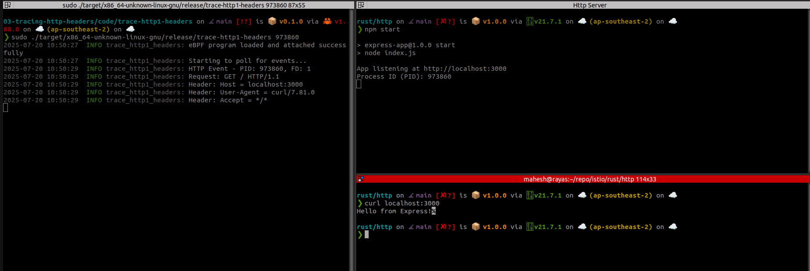

# trace-http1-headers

```bash
# compile the rust+ebpf program
cross build --release

```

## Start a http server locally
```bash

npm start 

```
get the pid of the http server


## 
```bash
#load and attach the ebpf program
# Pass the pid of the http server as an arg to our program
sudo ./target/x86_64-unknown-linux-gnu/release/trace-http1-headers <pid>

```

## 
```bash
#Invoke the http from another terminal
curl http://localhost:3000
```

## Output

